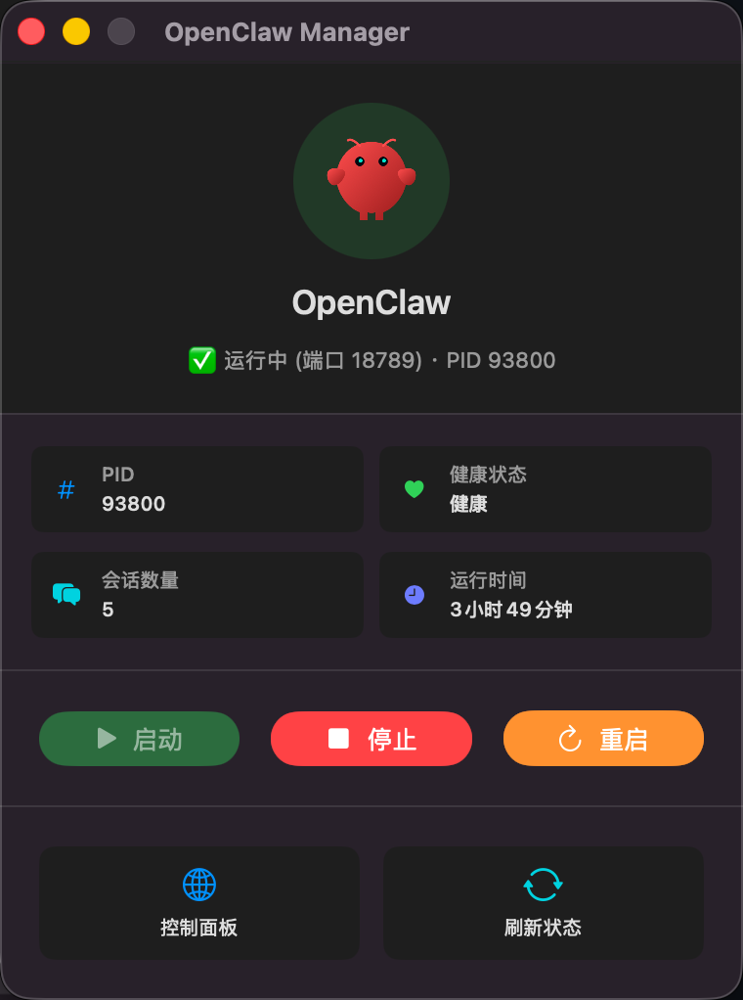

# OpenClaw Manager

<p align="center">
  
</p>

<p align="center">
  <strong>OpenClaw 网关服务的 macOS 原生图形化管理工具</strong>
</p>

<p align="center">
  
  
  
  
</p>

---

## 简介

<p align="center">
  
</p>

**OpenClaw Manager** 是一款轻量级的 macOS 原生应用，用于管理和监控 [OpenClaw] 网关服务。它使用 SwiftUI 构建了简洁直观的界面，并在菜单栏提供常驻图标，让你随时掌握网关运行状态。

## ✨ 功能特性

- 🚀 **一键控制** — 启动 / 停止 / 重启 OpenClaw 网关服务
- 📊 **实时监控** — 自动每 5 秒刷新服务状态（PID、健康状态、会话数量、运行时间）
- 🌐 **快速访问** — 一键打开 OpenClaw 控制面板 (Web Dashboard)
- 🐾 **菜单栏常驻** — 系统状态栏图标，关闭窗口后仍可通过托盘菜单操作
- 🎨 **原生体验** — 纯 Swift + SwiftUI 开发，无第三方依赖，体积小巧
- 🔧 **完整菜单** — 支持 macOS 标准菜单栏（应用菜单、文件、服务控制、窗口）

## 📋 系统要求

| 项目 | 要求 |
|------|------|
| 操作系统 | macOS 13.0 (Ventura) 或更高版本 |
| 开发工具 | Xcode Command Line Tools / Swift 5.7+ |
| 依赖 | `openclaw` CLI 已安装并在 PATH 中可用 |

## 🚀 快速开始

### 构建应用

项目提供了一键构建脚本，无需 Xcode 即可编译生成 `.app` 应用包：

```bash
# 克隆仓库
git clone https://github.com/ahusky/OpenClawManager.git
cd OpenClawManager

# 构建（自动检测当前架构 arm64 / x86_64）
./build.sh

# 构建 Universal 通用二进制（同时支持 Intel 和 Apple Silicon）
UNIVERSAL=1 ./build.sh
```

构建完成后，应用位于 `build/OpenClaw.app`。

### 运行

```bash
# 直接运行
open build/OpenClaw.app

# 安装到 Applications
cp -R build/OpenClaw.app /Applications/
```

### 代码签名

默认使用 ad-hoc 签名。如需使用开发者证书签名，设置环境变量：

```bash
SIGN_IDENTITY="Developer ID Application: Your Name (TEAM_ID)" ./build.sh
```

## 🏗️ 项目结构

```
OpenClawManager/
├── Sources/
│   └── main.swift          # 应用完整源码（模型、服务管理、UI、AppDelegate）
├── Package.swift            # Swift Package Manager 配置
├── build.sh                 # 一键构建脚本
├── Info.plist               # 应用 Info.plist 配置
├── entitlements.plist       # 应用权限声明
├── icon.png                 # 应用图标源文件
└── build/                   # 构建输出目录
    └── OpenClaw.app/        # 生成的 macOS 应用包
```

## 🔧 技术架构

### 核心模块

| 模块 | 说明 |
|------|------|
| **JSON Models** | 定义 `GatewayStatus`、`HealthStatus` 等数据模型，解析 `openclaw` CLI 的 JSON 输出 |
| **ServiceManager** | 单例服务管理器，负责执行 CLI 命令、刷新状态、端口检测 |
| **ContentView** | SwiftUI 主界面，展示服务状态、详情指标和控制按钮 |
| **AppDelegate** | 管理主窗口、菜单栏和系统托盘图标 |

### 命令映射

应用通过调用 `openclaw` CLI 来控制网关服务：

| 操作 | CLI 命令 |
|------|----------|
| 启动 | `openclaw gateway start` |
| 停止 | `openclaw gateway stop` |
| 重启 | `openclaw gateway restart` |
| 状态 | `openclaw gateway status --json` |
| 健康检查 | `openclaw health --json` |

### 状态检测

- **主检测**：解析 `openclaw gateway status --json` 获取服务运行状态、PID、绑定地址、RPC 状态等
- **健康检查**：解析 `openclaw health --json` 获取会话数量和运行时间
- **端口回退**：当 CLI 不可用时，通过 TCP Socket 探测 `127.0.0.1:18789` 端口作为备用检测

## 📸 界面说明

应用主界面分为以下区域：

1. **状态头部** — 显示应用图标、名称和当前运行状态
2. **详情面板** — 运行时展示 PID、健康状态、会话数量、运行时间四项指标
3. **控制按钮** — 启动（绿色）、停止（红色）、重启（橙色）三个操作按钮
4. **工具按钮** — 打开控制面板、刷新状态

## 🤝 开发

### 使用 Swift Package Manager

```bash
# 编译
swift build

# 运行（开发调试）
swift run
```

### 自定义图标

将图标文件放置在项目根目录，支持以下格式：

- `icon.png` / `icon.jpg` / `icon.jpeg` / `icon.tiff` / `icon.heic` / `icon.gif`
- `icon.icns`（直接使用，无需转换）

构建脚本会自动生成多分辨率 `.icns` 图标文件。

## 📄 许可证

本项目采用 MIT 许可证开源，详见 [LICENSE](LICENSE) 文件。
